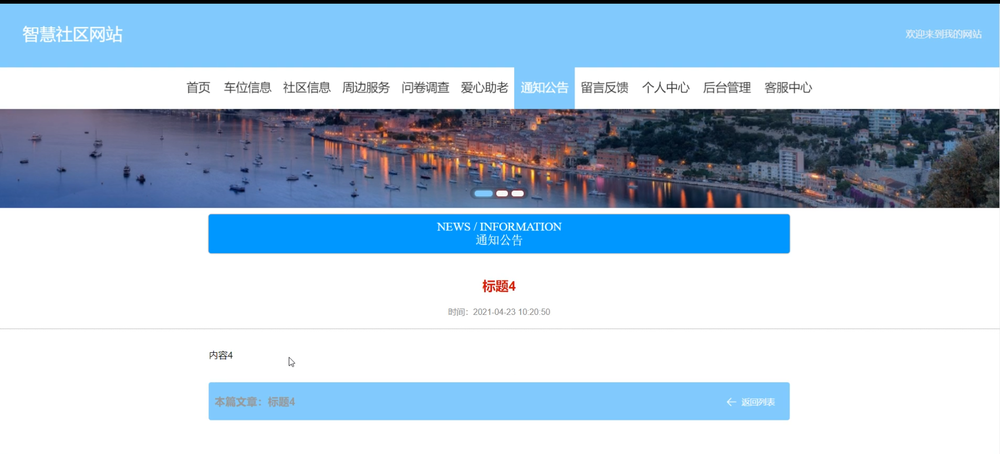
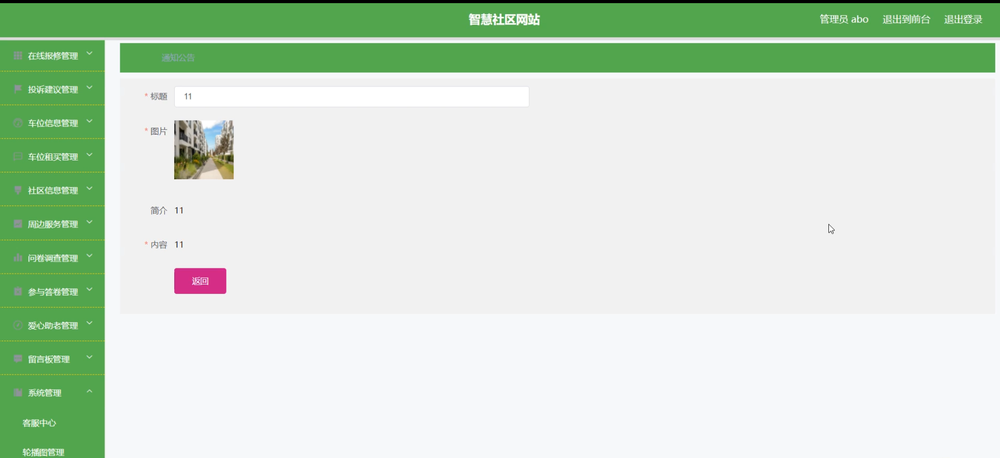

# 基于web的智慧社区设计与实现

#### 介绍

在数字化时代，智慧社区成为了提升居民生活品质、优化社区管理和服务的重要途径。本基于 Web 的智慧社区系统旨在通过信息化技术，整合社区资源，提高社区管理效率，为居民提供更加便捷、舒适和安全的生活环境。

#### 技术栈

后端技术栈：Springboot+Mysql+Maven

前端技术栈：Vue+Html+Css+Javascript+ElementUI

开发工具：Idea+Vscode+Navicate

#### 系统功能介绍

（一）管理员角色  

个人中心：查看和修改个人信息，接收重要通知和消息。  
客户管理：管理社区居民的基本信息，包括新增、修改、查询等操作。  
在线报修管理：处理居民的在线报修请求，分配维修任务，跟踪维修进度。  
投诉建议管理：接收和处理居民的投诉与建议，及时反馈处理结果。  
车位信息管理：维护社区车位的相关信息，如车位位置、状态等。  
车位租买管理：管理车位的租赁和购买业务，包括合同签订、费用收取等。  
社区信息管理：发布和更新社区的各类通知、活动等信息。  
周边服务管理：整合社区周边的商业服务资源，如超市、餐厅、理发店等。  
问卷调查管理：设计和发布社区相关的调查问卷，收集居民意见和需求。  
参与答卷管理：查看和分析居民的问卷答卷，为社区决策提供依据。  
爱心助老管理：组织和协调社区的助老关爱活动。  
留言板管理：审核和回复居民在留言板上的留言。  
系统管理：进行系统的参数设置、权限管理、数据备份与恢复等操作。  

（二）员工角色  

车位信息：查看车位的详细信息，协助管理车位状态。  
社区信息：了解社区的最新动态和通知。  
周边服务：为居民提供周边服务的相关信息和咨询。  
问卷调查：协助管理员开展问卷调查工作。  
爱心助老：参与社区的助老活动，提供服务和帮助。  
通知公告：查看社区发布的重要通知和公告。  
留言反馈：向管理员或其他员工留言反馈工作中的问题和建议。  
个人中心：修改个人资料，设置工作偏好。  
后台管理  
在线报修管理：协助处理在线报修事务。  
投诉建议管理：参与投诉建议的处理工作。  
车位租买管理：协助办理车位租买业务。  
社区信息管理：更新和发布部分社区信息。  
参与答卷管理：协助分析问卷答卷。  
爱心助老管理：具体执行助老关爱活动。  
我的收藏管理：管理个人收藏的社区相关信息。  
客服中心：为居民提供在线咨询和服务。  

#### 系统作用

提高社区管理效率  
实现社区事务的信息化管理，减少人工操作和纸质文件，提高工作效率。  
快速处理居民的报修、投诉和建议，提升社区服务的响应速度和质量。  
优化资源配置  
合理管理车位资源，提高车位的利用率。  
整合周边服务资源，为居民提供更多便利。  
增强社区互动与沟通  
通过问卷调查、留言板等功能，收集居民意见，促进社区民主决策。  
举办爱心助老等活动，增强社区居民之间的凝聚力和归属感。  
提升居民生活品质  
居民可以方便地获取社区信息、周边服务信息，享受便捷的生活。  
及时解决居民的问题和需求，提高居民对社区的满意度。  
促进社区可持续发展  
基于数据分析和居民反馈，不断优化社区服务和管理，实现社区的可持续发展。  

#### 系统功能截图

代码结构

数据库表

登录

前台页面首页

车位信息

社区信息

问卷调查

爱心助老

通知公告

留言反馈

客户端后台管理

参与答卷管理

管理员端客户管理

在线报修管理

系统管理

#### 总结

本基于 Web 的智慧社区系统，通过清晰的角色分工和丰富的功能模块，实现了社区管理的智能化和服务的精细化。管理员能够有效地统筹和管理社区事务，员工能够高效地执行各项任务，共同为居民打造一个舒适、便捷、和谐的社区环境。随着技术的不断进步和社区需求的变化，系统将不断完善和升级，为智慧社区的发展提供更强大的支持。

#### 使用说明

创建数据库，执行数据库脚本 修改jdbc数据库连接参数 下载安装maven依赖jar 启动idea中的springboot项目

后台地址：http://localhost:8080/springboot224bf/admin/dist/index.html

管理员  abo 密码 abo

前台地址：http://localhost:8080/springboot224bf/front/index.html

